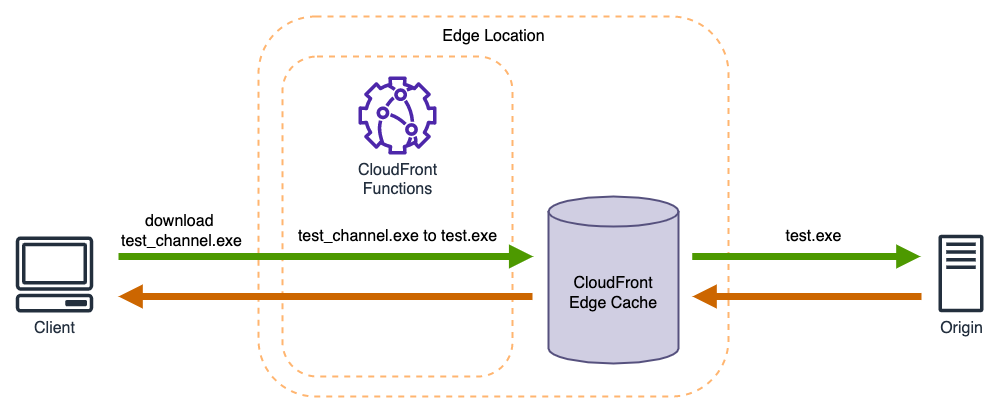

# installer distribution

The installer distribution feature allows you to add download channel information to your installation packages. This can be useful for attributing data to specific distribution channels in the future. 

The desktop client can download the installation package with the corresponding channel ID from the source by accessing the URL with the channel ID, and the specific process is as follows:

1. The desktop client accesses CloudFront through a URL with a channel ID. 
2. The CloudFront Functions redirect the URL in the viewer request to a URL without the channel ID.
3. A request is made to the origin using the URL without the channel ID. If the content is already cached in the CloudFront Edge Cache, it is returned directly.
4. The client obtains the installation package with the channel ID.

## Deployment Guide

Click on the [installer-distribution](https://console.aws.amazon.com/lambda/home#/create/app?applicationId=arn:aws:serverlessrepo:us-west-2:699461715380:applications/installer-distribution) to open the application page in the AWS Serverless Application Repository. Enter the name of the S3 bucket where the deployment package is stored, check the box to acknowledge that this application creates custom IAM roles, and click the Deploy button to install the application.

**Note:** The S3 bucket for storing the download packages must already be created. 

After the installation is complete, you can go to the CloudFormation console page, select the corresponding stack, and check Outputs to see the corresponding CloudFront domain name.

In your browser, enter https://\<your-cloudfront-domain\>/test_channel.exe to download and test.

**Note:** Replace \<your-cloudfront-domain\> with the CloudFront domain name you see, and make sure the test.exe file exists in your S3 bucket.

(Optional) Adjust the regular expression in CloudFront Functions as needed
In the CloudFront console page, select **Functions** and check the **ReURL-Function** function. Modify the code in the **Function code** section to target the URL that need to be converted to origin URL.

After modifying and testing successfully, click the **Publish function** button in the **Publish** tab of the page to publish it.

